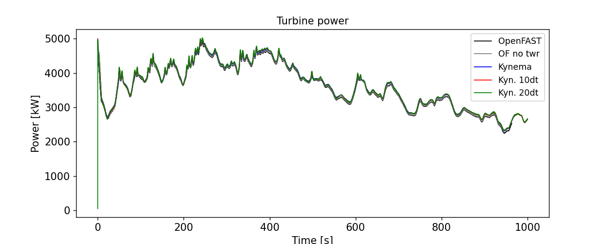
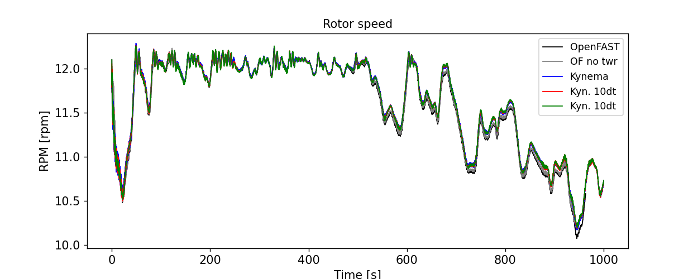
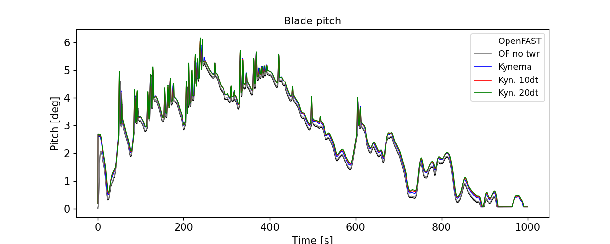
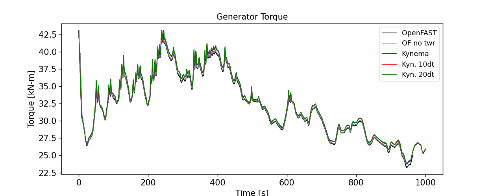
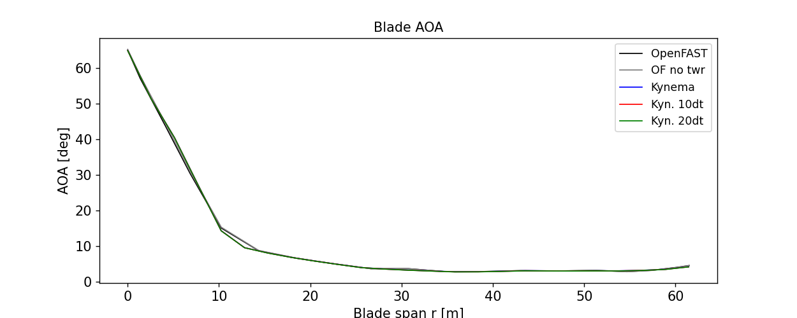
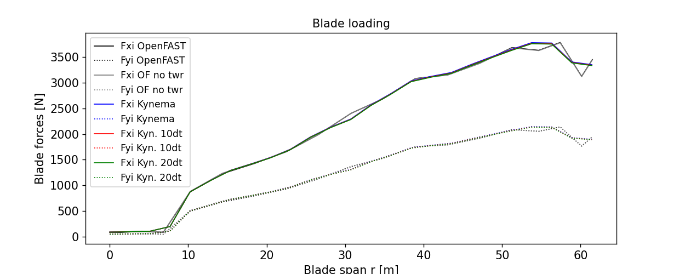

.. _sec-actuator-line-benchmark:

Actuator-line benchmark: NREL 5MW Turbine
-----------------------------------------

This page documents results from an actuator-line CFD benchmark based on the NREL 5MW reference
wind turbine, as defined in the ExaWind benchmark repository. The benchmark models a single NREL
5MW turbine using an actuator-line representation within a slightly convective, unstable
atmospheric boundary layer (ABL).

Fully coupled fluid–structure interaction (FSI) simulations performed with Kynema–AMR-Wind are
compared against the OpenFAST–AMR-Wind reference solution. The purpose of this benchmark is to
assess consistency in predicted turbine-level performance and spanwise aerodynamic quantities
between the two simulation frameworks.

.. note::
   Complete details of the benchmark definition, simulation setup, inflow, and
   post-processing steps are provided in the ExaWind Benchmarks documentation:
   `ExaWind Benchmarks (Actuator-line NREL 5MW in a convectively unstable ABL)
   <https://exawind.github.io/exawind-benchmarks/amr-wind/actuator_line/NREL5MW_ALM_BD/README.html>`_.

Simulation cases
^^^^^^^^^^^^^^^^

The figures below compare multiple simulation configurations, identified in the legends as follows:

.. list-table::
   :widths: 25 75
   :header-rows: 1

   * - Legend label
     - Description
   * - **OpenFAST**
     - Unchanged ExaWind benchmark case (OpenFAST–AMR-Wind).
   * - **OF no twr**
     - Benchmark case with tower aerodynamic points disabled.
   * - **Kynema**
     - Kynema–AMR-Wind using the same time step as OpenFAST.
   * - **Kyn. 10dt**
     - Kynema–AMR-Wind using 10× the OpenFAST time step (2 Kynema steps per AMR-Wind step).
   * - **Kyn. 20dt**
     - Kynema–AMR-Wind using 20× the OpenFAST time step (1 Kynema step per AMR-Wind step).

The "OF, no damp,twr" case is included to isolate differences arising from damping treatment and
tower aerodynamics. The larger time-step cases (Kyn. 10dt, Kyn. 20dt) demonstrate Kynema's ability
to maintain accuracy and stability with larger time steps.

Turbine results
^^^^^^^^^^^^^^^

This section compares time histories of turbine performance quantities from Kynema and OpenFAST.
The quantities shown include generator power, rotor thrust, rotor speed, blade pitch, and rotor
torque. These signals reflect both the mean operating state of the turbine and its unsteady
response to turbulent inflow and control actions.

Overall, Kynema predictions closely match the OpenFAST reference results, demonstrating consistent
aeroelastic behavior at the turbine level.

   Generator power comparison between Kynema and OpenFAST.

.. figure:: images/T0_RotThrust.png
   :width: 90%
   :align: center
   :alt: Rotor thrust comparison between Kynema and OpenFAST

   Rotor thrust comparison between Kynema and OpenFAST.

   Rotor speed comparison between Kynema and OpenFAST.

   Blade pitch comparison between Kynema and OpenFAST.

   Rotor torque comparison between Kynema and OpenFAST.

Blade loading profiles
^^^^^^^^^^^^^^^^^^^^^^^

To further assess the actuator-line implementation, we compare spanwise distributions of sectional
blade quantities. The results show close agreement between Kynema and OpenFAST for angle of attack,
normal and tangential force coefficients, and sectional force components.

   Angle of attack comparison between Kynema and OpenFAST.

.. figure:: images/T0_CnCt.png
   :width: 90%
   :align: center
   :alt: Normal/tangential coefficient comparison between Kynema and OpenFAST

   Sectional normal/tangential coefficient comparison between Kynema and OpenFAST.

   Sectional force components comparison between Kynema and OpenFAST.
