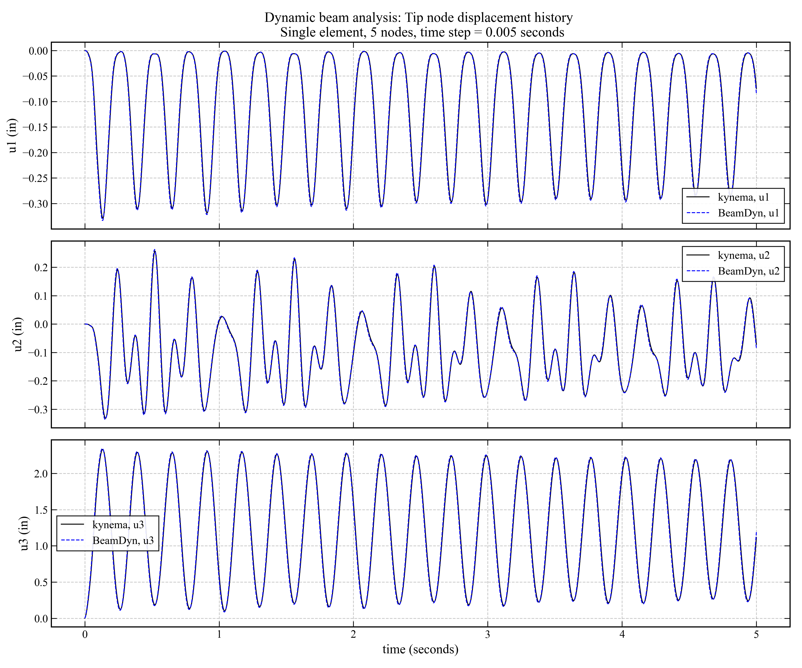

.. _sec-dynamic-composite:

Dynamic bending of a straight composite beam
--------------------------------------------

In this benchmark problem we examine the transient tip response of a straight composite beam
subjected to a transverse tip load. The problem setup and sectional properties follow those
of [@Wang-etal:2017]. The beam is modeled with a single Legendre Spectral Finite Element (LSFE)
using :math:`n = 5` nodes. The beam is clamped at the root and a point force
:math:`P_z = 150` lb is applied at the tip node in the global :math:`z`-direction.

BeamDyn is used to provide a benchmark solution. The following figure compares the tip
displacement components (:math:`u_1`, :math:`u_2`, :math:`u_3`) for the dynamic response of the
composite beam between Kynema and BeamDyn over 5 seconds of simulation time with a time step size
of :math:`\Delta t = 0.005` s. The comparison shows good agreement between the two solutions.

   Comparison of tip displacement components (:math:`u_1`, :math:`u_2`, :math:`u_3`) for the dynamic
   composite beam between Kynema and BeamDyn for a single LSFE with :math:`n = 5` nodes and time step
   :math:`\Delta t = 0.005` s.

.. note::

   This benchmark is included as a regression test in the Kynema code base.
   The test is implemented in:

     https://github.com/kynema/kynema/blob/main/tests/regression_tests/regression/verification/dynamic_composite_beam_bending.cpp

.. container:: csl-entry
   :name: ref-Wang-etal:2017

   Wang, Q., M. A. Sprague, J. Jonkman, N. Johnson, and B. Jonkman. 2017. “BeamDyn:
   a high-fidelity wind turbine blade solver in the FAST modular framework.”
   *Wind Energy* 20: 1439–1462.
   https://onlinelibrary.wiley.com/doi/pdf/10.1002/we.2101
