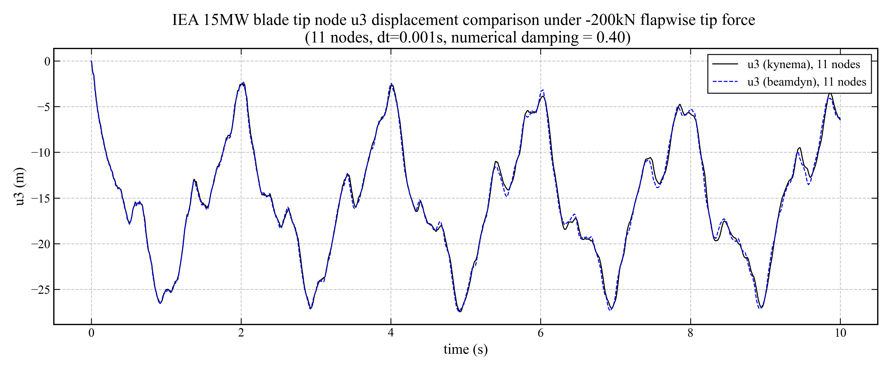

.. _sec-dynamic-iea15mw-blade:

Dynamic bending of the IEA 15 MW reference wind turbine blade
-------------------------------------------------------------

In this benchmark problem we examine the transient flapwise tip response of the
IEA 15 MW reference wind turbine blade (using the `IEA-15-240-RWT` definition in
WindIO format) subjected to a concentrated tip load. The blade structural
properties (reference axis, twist distribution, and sectional 6x6 mass and
stiffness matrices) are read directly from the WindIO YAML file and mapped to a
Legendre Spectral Finite Element (LSFE) beam model with :math:`n = 11` nodes.
The blade is clamped at the root, and a point force :math:`P_z = -200` kN is
applied at the tip node in the global :math:`z`-direction (i.e., flapwise
direction) to simulate a wind loading condition. This load is large enough to
cause a significant deflection of the tip node (approximately 20% of the blade
length of ~118 meters), which is important for testing the accuracy of the nonlinear
response of the geometrically exact beam element.

The transient response is computed with Kynema's dynamic solver using a
generalized-:math:`\alpha` time integrator with numerical damping parameter
:math:`\rho_\infty = 0.4`, a time-step size of :math:`\Delta t = 0.001` s, and
a total simulated time of 10 seconds. BeamDyn is used to provide a benchmark solution
for the same blade model, loading, and time-integration parameters. The tip
out-of-plane displacements from Kynema are compared against the BeamDyn
benchmark solution in the following figure. The comparison shows good agreement,
with Kynema results lying within 1% relative difference of the BeamDyn
displacements over the vast majority of the response history.

   Comparison of tip flapwise displacement (:math:`u_3`) for the IEA 15 MW
   reference blade between Kynema and BeamDyn for a single LSFE model with
   :math:`n = 11` nodes under a tip load of :math:`-200` kN, with a time-step size
   of :math:`\Delta t = 0.001` s.

.. note::

   This benchmark is included as a regression test in the Kynema code base.
   The test is implemented in:

     https://github.com/kynema/kynema/blob/main/tests/regression_tests/regression/verification/dynamic_IEA15MW_blade_bending.cpp
